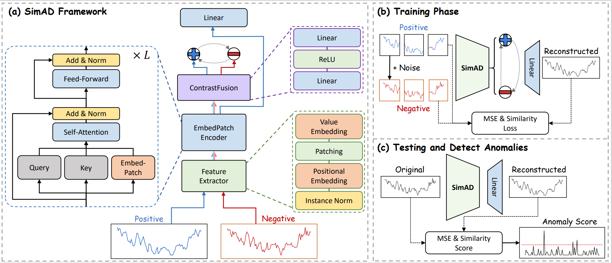
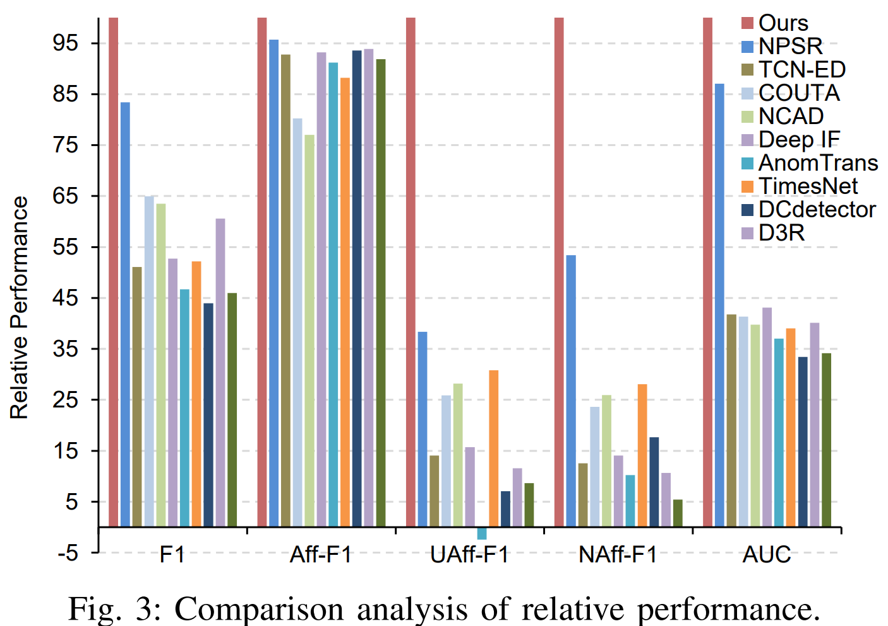

## 📑SimAD: A Simple Dissimilarity-based Approach for Time Series Anomaly Detection

This is the implementation of *SimAD: A Simple Dissimilarity-based Approach for Time Series Anomaly Detection*

The paper is under review. You can download the paper from [arXiv](https://arxiv.org/abs/2405.11238).

## 📰Abstract

Despite the prevalence of reconstruction-based deep learning methods, time series anomaly detection remains a tremendous challenge.
Existing approaches often struggle with limited temporal contexts, insufficient representation of normal patterns, and flawed evaluation metrics, all of which hinder their effectiveness in detecting anomalous behavior.
To address these issues, we introduce a **Sim**ple dissimilarity-based approach for time series **A**nomaly **D**etection, referred to as **SimAD**. 
Specifically, SimAD first incorporates a patching-based feature extractor capable of processing extended temporal windows and employs the EmbedPatch encoder to fully integrate normal behavioral patterns. 
Second, we design an innovative ContrastFusion module in SimAD, which strengthens the robustness of anomaly detection by highlighting the distributional differences between normal and abnormal data.
Third, we introduce two robust enhanced evaluation metrics, Unbiased Affiliation (UAff) and Normalized Affiliation (NAff), designed to overcome the limitations of existing metrics by providing better distinctiveness and semantic clarity.
The reliability of these two metrics has been demonstrated by both theoretical and experimental analyses. Experiments conducted on seven diverse time series datasets clearly demonstrate SimAD's superior performance compared to state-of-the-art methods, achieving relative improvements of **19.85%** on F1, **4.44** on Aff-F1, **77.79** on NAff-F1, and **9.69** on AUC on six multivariate datasets.
Code and pre-trained models are available at [https://github.com/EmorZz1G/SimAD](https://github.com/EmorZz1G/SimAD).

## 🛠Architecture

## 📊Overall Performance

  
  <!--  -->

## 📎Model download link

https://drive.google.com/drive/folders/1dDH3JRivRYEU02riHzGFUu74OxiwDax6?usp=sharing [^1]

## 💾Datasets

You can download all datasets [here](https://drive.google.com/drive/folders/1RaIJQ8esoWuhyphhmMaH-VCDh-WIluRR?usp=sharing).
(Thanks for [DCdetector](https://github.com/DAMO-DI-ML/KDD2023-DCdetector/blob/main/readme.md) repo and its authors.)

## 🔧Installation

You can refer to requirements.txt to install all the packages.

> pip install -r requirements.txt

## 🔧Quick Start

1. You should download the datasets into ABSOLUTE/PATH/OF/DATASET.
2. The dataset structure should be like 'dataset_struct.txt'
3. Run the scripts below.
4. Note that the most important is you should change the parameter of --data_pth.
5. We use --save_pth and --logs_pth for model and result saving.
6. --resume controls whether to reload the trained model.

### Train

`python main.py --data_name MSL --win_size 25600 --lr 0.0001 --gpu -1 --resume 0 --index 1 --batch_size 32 --step 1 --use_amp 0 --warmup_steps 20000 --warmup_max_ratio 0.2 --data_pth ABSOLUTE/PATH/OF/DATASET`

### Inference

`python main.py --data_name MSL --win_size 25600 --lr 0.0001 --gpu -1 --resume 1 --index 1 --batch_size 32 --step 1 --use_amp 0 --warmup_steps 20000 --warmup_max_ratio 0.2 --data_pth ABSOLUTE/PATH/OF/DATASET`

## 📎 Citation

**If you find this repo useful, please cite our paper or leave a star.**

@misc{zhong2024simad,
&nbsp;&nbsp;&nbsp;&nbsp;title={SimAD: A Simple Dissimilarity-based Approach for Time Series Anomaly Detection},
&nbsp;&nbsp;&nbsp;&nbsp;author={anonymous authors},
&nbsp;&nbsp;&nbsp;&nbsp;year={2024},
&nbsp;&nbsp;&nbsp;&nbsp;eprint={2405.11238},
&nbsp;&nbsp;&nbsp;&nbsp;archivePrefix={arXiv},
&nbsp;&nbsp;&nbsp;&nbsp;primaryClass={cs.LG}
}

## 🥰Acknowledgement

We appreciate the following github repos a lot for their valuable code:

[https://github.com/TheDatumOrg/VUS](https://github.com/TheDatumOrg/VUS)

[https://github.com/ahstat/affiliation-metrics-py](https://github.com/ahstat/affiliation-metrics-py)

[^1]: The model trained on MSL dataset is too large. We are willing to upload it in the future.
    
[^2]: **We have not tested it to make sure it can be installed successfully. We will test it in the future.**
