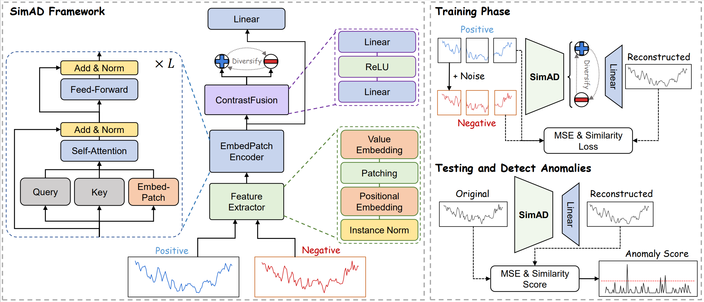
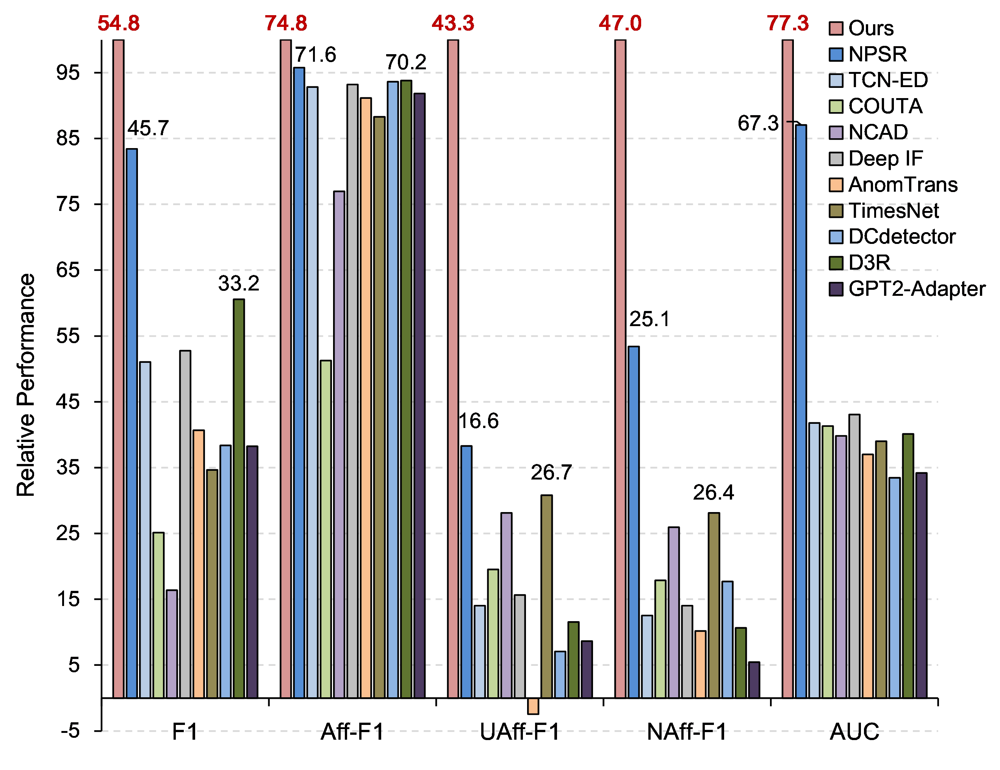

# SimAD
This is the implementation of *SimAD: A Simple Dissimilarity-based Approach for Time Series Anomaly Detection*

The paper is under review.

# Abstract
Despite the prevalence of reconstruction-based deep learning methods, time series anomaly detection remains a challenging task. Existing approaches often struggle with limited temporal contexts, inadequate representation of normal patterns, and flawed evaluation metrics, hindering their effectiveness in identifying aberrant behavior.
To address these issues, we introduce **SimAD**, a **Sim**ple dissimilarity-based approach for time series **A**nomaly **D**etection. SimAD leverages a feature extractor capable of handling extended time windows, employs the EmbedPatch encoder to effectively integrate normal features, and introduces a novel ContrastFusion module to amplify distributional discrepancies between normal and anomalous data, thereby facilitating robust anomaly discrimination.
Additionally, we propose two robust evaluation metrics, UAff and NAff, addressing the limitations of existing metrics and demonstrating their reliability through theoretical and experimental analyses.
Experiments across **seven** diverse time series datasets demonstrate SimAD's superior performance compared to state-of-the-art methods, achieving relative improvements of **19.85%** on F1, **4.44%** on Aff-F1, **77.79%** on NAff-F1, and **9.69%** on AUC on six multivariate datasets.
Code and pre-trained models are available at [https://github.com/EmorZz1G/SimAD](https://github.com/EmorZz1G/SimAD).

## Architecture

## Overall Performance 

  
  <!--  -->

## Model download link

https://drive.google.com/drive/folders/1dDH3JRivRYEU02riHzGFUu74OxiwDax6?usp=sharing [^1]

[^1]: The model trained on MSL dataset is too large. We are willing to upload it in the future.

